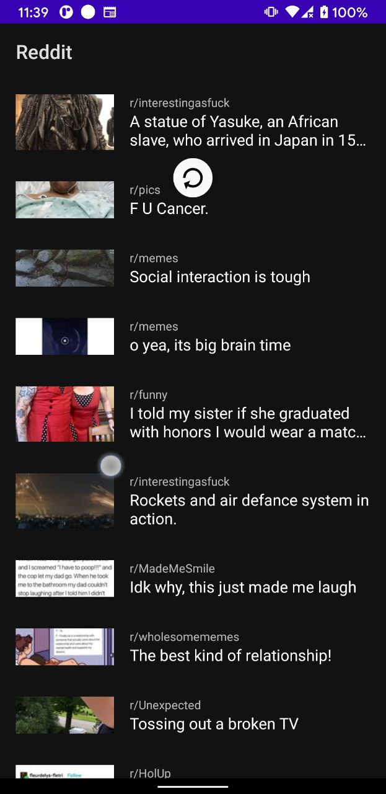

#  Reddit Demo

This is an simple post listing android application

## Installation
Clone this repository and import into **Android Studio**
```bash
git clone https://github.com/alvarosct02/RedditDemo.git
```

## Tech Stack:

- Kotlin
- MVVM
- Koin
- Coroutines
- ViewModel
- Room
- Navigation Component
- Databinding
- Retrofit
- Glide
- Mockk


## Core Features:

| List Top Reddits | Pull to refresh | Load more Reddits |
| --- | --- | --- |
|  |  |  |

## Other implemented features:

- Display Reddit details (only for Reddits with images in PNG and JPG format)
- Save Reddit image into photo library
- Offline mode
- Transitions 
- Offline mode
- Light/Night Theme
- Unit Tests
- CI/CD with Github Actions + AppCenter

| Landscape View | Save Images | Light/Night Theme |
| --- | --- | --- |
|  |  |  |


## Maintainers
This project is mantained by:
* [Alvaro Santa Cruz](http://github.com/alvarosct02)

## Contributing

1. Fork it
2. Create your feature branch (git checkout -b my-new-feature)
3. Commit your changes (git commit -m 'Add some feature')
4. Push your branch (git push origin my-new-feature)
5. Create a new Pull Request
